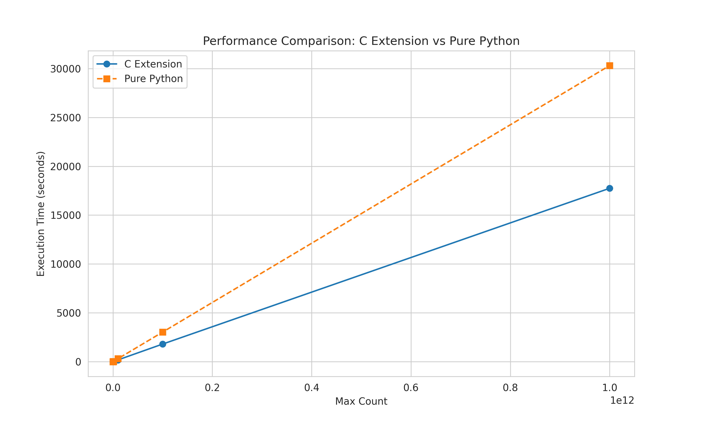
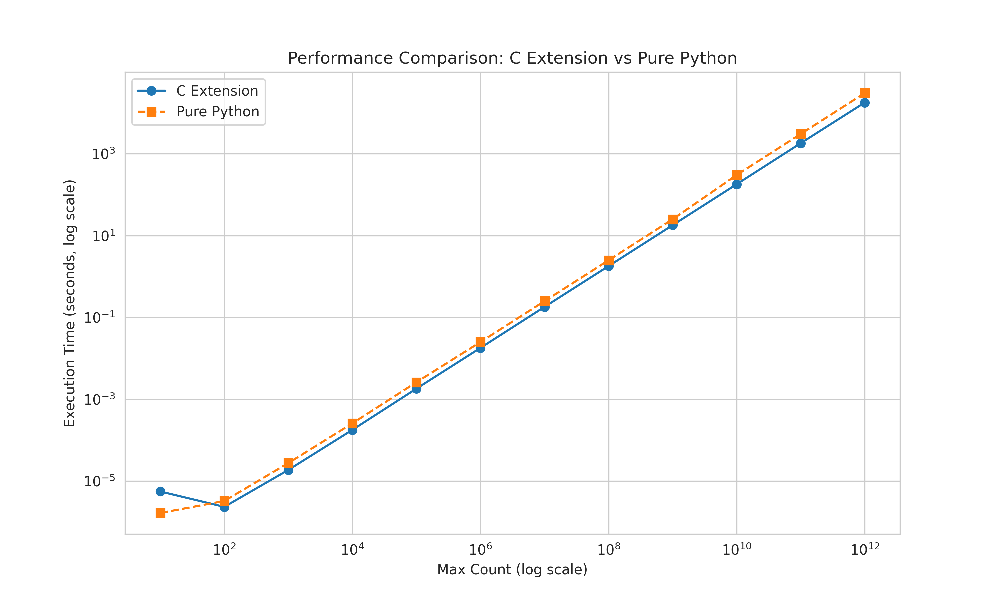

#### count module

```commandline
python3 setup.py build_ext --inplace
pyhton3 benchmark.py
```

```text
For 10000000000.0 as max value:
CPython C extension time: 179.725857 seconds
Pure Python generator time: 458.229013 seconds
Speedup: 2.55x faster with C extension
```

#### Performance comparison

Linear scale



Logarithmic scale


